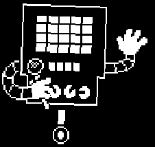

+++
title = "Mettaton (镁塔顿) - 初始形态"
description = "Undertale boss animation analysis - Mettaton (Initial Form)"
date = 2026-04-11T22:29:21+08:00
updated = 2026-04-11T22:29:21+08:00
draft = false
weight = 5
sort_by = "weight"
template = "docs/page.html"

[extra]
toc = true
top = false
+++


---

## 组成拆解

Mettaton 由 **双臂（arms）+ 铁盒子外壳（nuts）** 组成。

图片里所示的双臂是 arms2，一共有五个不同的双臂图片。



## 公式整理

```plaintext
特殊计时器：
sinvalue = 2 * sin(time / 3)

----------------------

外壳：
x：x + sinvalue
y：y
角度：sinvalue

双臂：
x：x + sinvalue
y：y - 5 * sin(time / 4)
角度：sinvalue
```