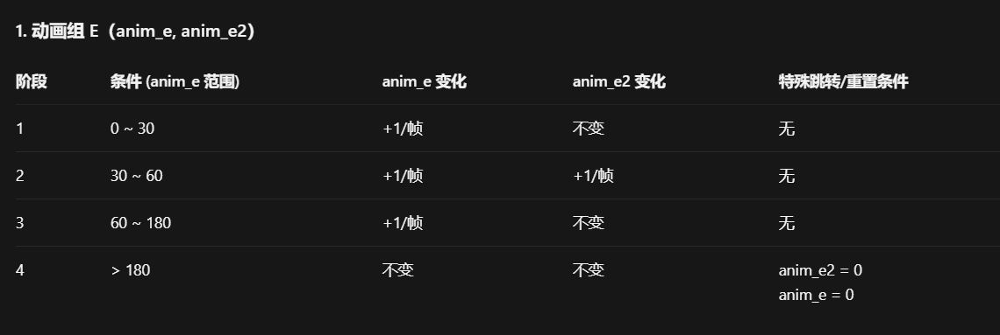
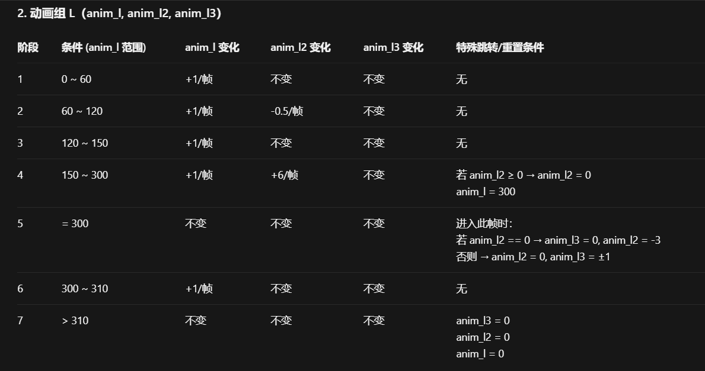
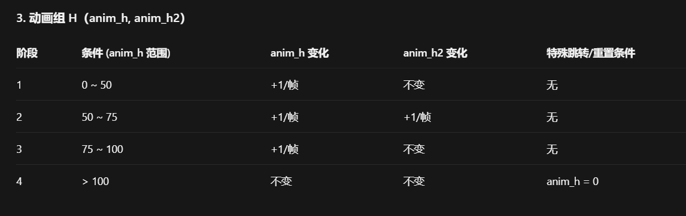
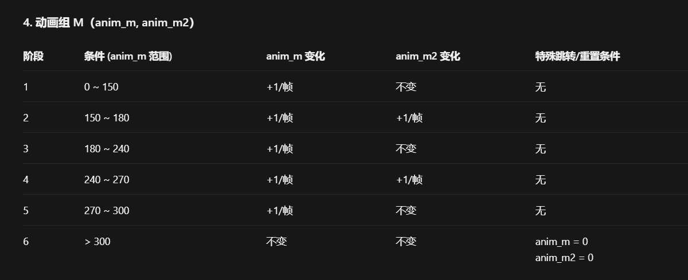

+++
title = "Knight Knight (晚安骑士)"
description = "Undertale enemy animation analysis - Knight Knight"
date = 2026-04-11T22:29:21+08:00
updated = 2026-04-11T22:29:21+08:00
draft = false
weight = 5
sort_by = "weight"
template = "docs/page.html"

[authors]
  - name = "毫无技术的鸽子"

[extra]
toc = true
top = false
+++


---

## 组成拆解

Knight Knight 由 **拿矛的手（leftarm）+ 最顶上的牛角头盔（helmet）+ 龙一般的嘴（dragonmouth）+ 会动的胡须（dragonfur）+ 一整个外壳（body）+ 眼睛（dragoneyes）** 组成。


## 公式整理

```plaintext
眼睛：
x：x - 60 + 94 + 6 * sin(time / 10)
y：y + 70
有人说你这只整理了一个啊？
热知识：眼睛的三种形态用的全是这个公式

身体：
x：x - 60
y：y

头盔：
x：x - 60 + 70
y：y + 2

嘴：
x：x - 60 + 98
y：y + 84

胡须：
x：x - 60 + 64
y：y + 96

手臂：
x：x - 60 + animl3
y：y + animl2
```

toby 的定时动画一如既往的稳定发挥。

## 招牌动作

晚安骑士的招牌动作就是手臂缓慢升起，然后捶地，捶地之后还有一段晃动期，这里仍旧给出表格：









> 一般人不要碰这个代码，听我的。甚至我看了这些代码都不想讲。