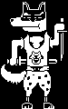

+++
title = "Doggo (遁狗)"
description = "Undertale enemy animation analysis - Doggo"
date = 2026-04-11T22:29:21+08:00
updated = 2026-04-11T22:29:21+08:00
draft = false
weight = 5
sort_by = "weight"
template = "docs/page.html"

[extra]
  author = "毫无技术的鸽子"

  toc = true
  top = false
+++


---

## 组成拆解

Doggo 由 **身体（body）+ 头部（head）+ 双臂（arms）+ 尾巴（tail）** 组成。



## 公式

```plaintext
身体，尾巴，头部均保持不动：

手臂：
若sin(time / 4.5) > 0，那么手臂y增加0.8；
反之减少0.8
```