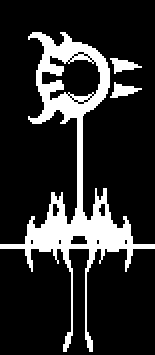
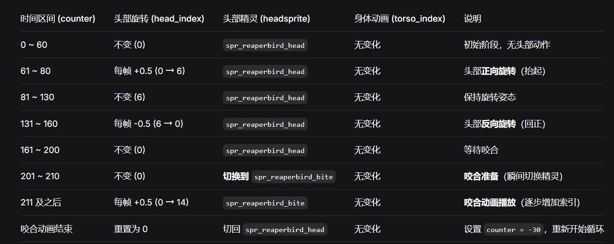
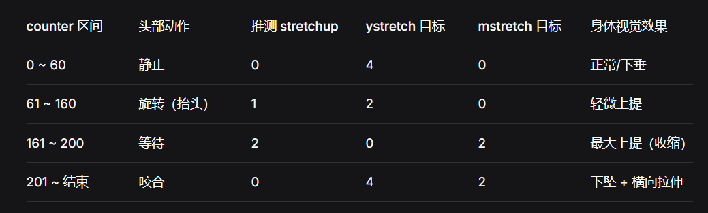

+++
title = "Reaper Bird (死神鸟)"
description = "Undertale enemy animation analysis - Reaper Bird"
date = 2026-04-11T22:29:21+08:00
updated = 2026-04-11T22:29:21+08:00
draft = false
weight = 3
sort_by = "weight"
template = "docs/page.html"

[extra]
  author = "毫无技术的鸽子"

  toc = true
  top = false
+++


---

## 组成拆解

Reaper Bird 由 **头部（head+bite）+ 身体（body）** 组成。



还记得福音蟑螂的随机动手吗？死神鸟这里则是切换之后进行嘴巴咬合。

## 公式整理

```plaintext
身体：
x：x + 14 + 5 * sin(time / 10)
y：y + 90 + 6 * abs(cos(time / 8)) - 20 * mstretch
yscale：ystretch
```

请输入文本（这是头部动画）：



这里是身体拉伸的动画：

