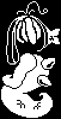

+++
title = "Shyren (害羞塞壬)"
description = "Undertale enemy animation analysis - Shyren"
date = 2026-04-11T22:29:21+08:00
updated = 2026-04-11T22:29:21+08:00
draft = false
weight = 6
sort_by = "weight"
template = "docs/page.html"

[authors]
  - name = "毫无技术的鸽子"

[extra]
toc = true
top = false
+++


---

## 组成拆解

Shyren 由 **底座（agent）+ 头部（hide/swim/sing）** 组成。



## 公式整理

```plaintext
底座保持不动
头部：
y：sy + 4 * sin(time / 30)
```