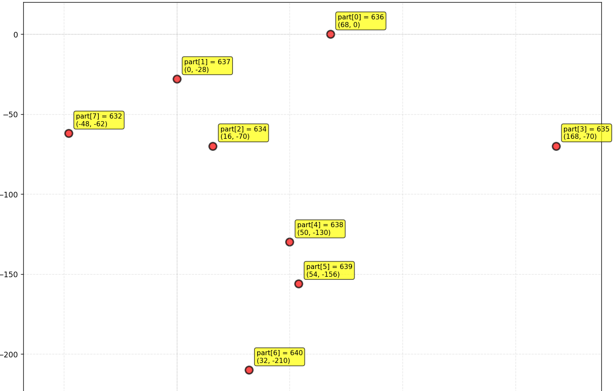

+++
title = "Asgore (艾斯戈尔/羊爸)"
description = "UNDERTALE boss animation analysis - Asgore"
date = 2026-04-11T22:29:21+08:00
updated = 2026-04-11T22:29:21+08:00
draft = false
weight = 9
template = "page.html"

[extra]
  author = "毫无技术的鸽子"

  toc = true
  top = false
+++


---

## 组成拆解

Asgore 由 **披风/斗篷（cape）+ 胳膊（ballarm）+ 左边的胳膊（arml）+ 右边的胳膊（armr）+ 头部（head1）+ 带有符文标志的盔甲（armor）+ 下面三个角的裙子（dress）+ 腿部（legs）+ 脚（feet）** 组成。


我们先来看点位图解（这个是我用 Python 模拟的）：



Asgore 的绘制分为两部分，一部分绘制头、身子、腿、脚；另一部分由三叉戟控制，绘制手臂、手、三叉戟

## 公式整理（三叉戟）

```plaintext
三叉戟：
x：x
y：y + 0.3 * sin(time / 15)
角度：0.02 * sin(time / 15)

手臂：
x：part[5].x + 14 + body.x
y：part[5].y + 64 + body.y
角度：由自身(x, y)指向(x - 55 * 0.02 * cos(time / 15), y - 55 * 0.02 * sin(time / 15))
xscale：和角度目标点进行勾股定理距离计算后除以40
x：part[4].x + 34 + body.x
y：part[4].y + 64 + body.y
设rdistx, rdisty, armlen
令rdistx = x + 110 * cos(0.02 * sin(time / 15))
rdisty = y + 110 * sin(0.02 * sin(time / 15))
armlen = (x, y)和(rdistx, rdisty)的距离
若armlen > 100
那么令armoff = (armlen - 100) / 2
rdistx = x + (110 - 2 * armoff) * cos(0.02 * sin(time / 15))
rdisty = y + (110 - 2 * armoff) * sin(0.02 * sin(time / 15))
随后角度和长度计算使用(x, y)和(rdistx, rdisty)

右手：
x：rdistx
y：rdisty
角度：sin(time / 15)

左手：
x：x - 55 * 0.02 * cos(time / 15)
y：y - 55 * 0.02 * sin(time / 15)
角度：sin(time / 15)
```

## 剩余部分

```plaintext
脚：依旧静止不动
腿：仍然静止不动

下面为了方便就不写xy了，xy在上面的python图里，直接看幅度：
头部：0.3
身体：0.2
裙子：0.1
双手：再加0.1
披风：0.05
```