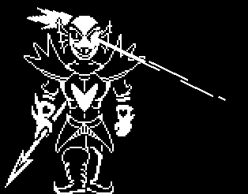

+++
title = "Undyne (安黛因) - 屠杀路线"
description = "UNDERTALE boss animation analysis - Undyne (Genocide Route)"
date = 2026-04-11T22:29:21+08:00
updated = 2026-04-11T22:29:21+08:00
draft = false
weight = 4
template = "page.html"

[extra]
  author = "毫无技术的鸽子"

  toc = true
  top = false
+++


---

## 组成拆解

Undyne（屠杀路线）和中立路线一样，唯独多了一个**眼睛放光（eyebeam）**。



## 公式整理

```javascript
头发：
x：x + 85
y：y + 3 * sin(time / 6) + heady + 4
角度：70 - 15 * sin(time / 6)

腿部：
x：x + 100
y：y + 164

左臂：
x：x + 64 + 5 * sin(time / 6)
y：y + 78 + 5 * sin(time / 6)

右臂：
x：x + 136 + 3 * sin(time / 3)
y：y + 78 + 6 * sin(time / 6) + 2 * sin(time / 3)

盔甲：
x：x + 100
y：x + 78 + 4 * sin(time / 6)
角度：-4 * sin(time / 6)

裤子：
x：x + 100
y：y + 122 + 2 * sin(time / 6)
角度：2 * sin(time / 6)

头部：
x：x + 100
y：y + 28 + 2 * sin(time / 6) + heady

激光：
x：x + 110
y：y + 24 + 2 * sin(time / 6)
xscale：(etime - 10) / 4
yscale：2.5 - (etime - 10) / 20
角度：-32 * sin(time / 14)
透明度：1.5 - (etime - 10) / 20
```

### 补充说明

etime 是一个持续增加的变量，每帧加 1，如果大于等于 40 那么归零。