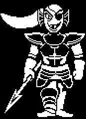

+++
title = "Undyne (安黛因) - 中立路线"
description = "UNDERTALE boss animation analysis - Undyne (Neutral Route)"
date = 2026-04-11T22:29:21+08:00
updated = 2026-04-11T22:29:21+08:00
draft = false
weight = 3
template = "page.html"

[extra]
  author = "毫无技术的鸽子"

  toc = true
  top = false
+++


---

## 组成拆解

Undyne 由 **头发（hair）+ 脸（face）+ 盔甲（armor）+ 腿部（legs）+ 裤子（pants）+ 拿矛的手（leftarm）+ 握拳的右手（rightarm）** 组成。



## 公式整理

```plaintext
头发y：ys + 4 * sin(time / 6)
头部y：ys + 2 * sin(time / 6)
盔甲y：ys + 4 * sin(time / 6)
裤子y：ys + 2 * sin(time / 6)
左臂：
x：xs + 5 * sin(time / 6)
y：ys + 5 * sin(time / 6)
右臂：
x：xs - 2 * sin(time / 3)
y：ys + 6 * sin(time / 6) + 2 * sin(time / 3)
```