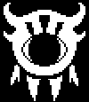
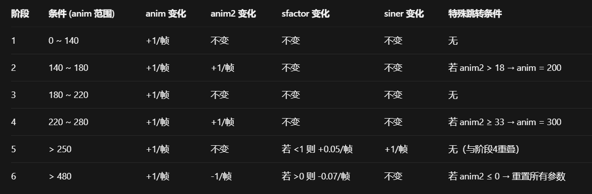

+++
title = "Astigmatism (散光眼)"
description = "Undertale enemy animation analysis - Astigmatism"
date = 2026-04-11T22:29:21+08:00
updated = 2026-04-11T22:29:21+08:00
draft = false
weight = 3
template = "page.html"

[extra]
  author = "毫无技术的鸽子"

  toc = true
  top = false
  utaf_data = "/utaf/core/astigmatism.json"
  utaf_lab_url = "/lab/astigmatism/"
+++


---

## 组成拆解

Astigmatism 由 **头部（anim2）+ 手臂（hand）+ 腿部（leg）** 组成。



## 公式整理

```plaintext
由于这个计时器较为复杂
我们先说手臂和腿部的公式：

手臂：
x：x + 8 + 2 * sfactor * sin(time / 6)
y：y + 64 + 2 * sfactor * cos(time / 6)
yscale：1.8 + 0.2 * sfactor * cos(time / 6)
x：x + 92 - 2 * sfactor * sin(time / 6)
y：y + 64 - 2 * sfactor * cos(time / 6)
yscale：1.9 + 0.2 * sfactor * cos(time / 6)

腿部：
x：x + 30 + 2 * sfactor * sin(time / 6)
y：y + 84 + 2 * sfactor * sin(time / 6)
yscale：1.8 + 0.2 * sfactor * cos(time / 6)
x：x + 70 - 2 * sfactor * sin(time / 6)
y：y + 84 - 2 * sfactor * sin(time / 6)
yscale：1.8 - 0.2 * sfactor * cos(time / 6)
```

### 神秘计时器源码

```plaintext
anim += 1
if (anim > 250)
{
    if (sfactor < 1)
        sfactor += 0.05
    siner += 1
}
if (anim > 140 && anim < 180)
{
    anim2 += 1
    if (anim2 > 18)
        anim = 200
}
if (anim > 220 && anim < 280)
{
    anim2 += 1
    if (anim2 >= 33)
        anim = 300
}
if (anim > 480)
{
    if (sfactor > 0)
        sfactor -= 0.07
    anim2 -= 1
    if (anim2 <= 0)
    {
        sfactor = 0
        anim2 = 0
        anim = 0
    }
}
```

### 解释

首先，sfactor 这个变量，被规定在了 0~1 中间，这个数控制着散光眼的手臂和腿部晃动幅度，比如散光眼会在动画播放完之后，才开始晃动，本质上改变的就是 sfactor 的大小。

然后是 anim 和 anim2 变量，anim 负责不断增加，anim2 负责不断减少。执行 anim > 480 的时候，散光眼张嘴，同时 anim2 开始减小，经过 33 + 250 帧之后，重新执行行走动画，具体表格看这里：

