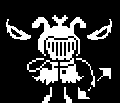

+++
title = "Whimsalot (忧伤虫爵士)"
description = "UNDERTALE enemy animation analysis - Whimsalot"
date = 2026-04-11T22:29:21+08:00
updated = 2026-04-11T22:29:21+08:00
draft = false
weight = 2
template = "page.html"

[extra]
  author = "毫无技术的鸽子"

  toc = true
  top = false
  utaf_data = "/utaf/core/whimsalot.json"
  utaf_lab_url = "/lab/whimsalot/"
+++


---

## 组成拆解

Whimsalot 由 **身体（body）+ 头部（head）+ 翅膀（wing）** 组成。



## 公式整理

```javascript
特殊计时器：goof
goof = sin(time / 5)

---------------------

翅膀：
x：x + 60; x + 14
y：y + 40 - goof * 2
角度：±(15 - 30 * sin(time / 2.5))
（左翅膀通过 xscale = -2 镜像，使用相同精灵）

身体：
x：x
y：y + 50 + goof * 6

头部：
x：x + 6
y：y + goof * 8
```

> **维护者注：** 翅膀精灵 `spr_whimsalot_wing_r`（17×14）在 GameMaker 中的 origin 为 (0, 14)，即左下角（翅膀与身体的连接处）。翅膀的旋转（±30°）围绕此连接点进行，而非围绕翅膀中心。UTAF 实现中 `pivot` 设为 `(-1, 14)`（x 方向偏移 -1 是因为提取的 PNG 裁剪了 1 列左侧透明像素）。