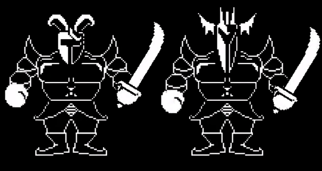

+++
title = "Royal Guards (皇家守卫 01 / 02)"
description = "UNDERTALE enemy animation analysis - Royal Guards"
date = 2026-04-11T22:29:21+08:00
updated = 2026-04-11T22:29:21+08:00
draft = false
weight = 5
template = "page.html"

[extra]
  author = "毫无技术的鸽子"

  toc = true
  top = false
+++


---

## 组成拆解

Royal Guards 由 **头部（head）+ 盔甲（armor）+ 盔甲手臂（baraball）+ 腿部（baralegs）+ 靴子（barashoes）+ 握拳的手（barafist）+ 拿剑的手，也包括剑（falchion）** 组成。

是的，守卫的胳膊是通过两个球进行连接的，所以一共四个球都有自己的公式。



## 公式整理

```javascript
胳膊：
x：x + 110/120
y：y + 40/60 + 3 * sin(timie / 4)
x：x - 10/20
y：y + 40/60 + 3 * sin(timie / 4)

拿剑的手：
x：x + 140
y：y + 80 + 16 + 4 * cos(time / 4)
角度：-30 + 4 * sin(time / 4)

握拳的手：
x：x - 10
y：y + 80 + 16 + 4 * cos(time / 4)
角度：4 * sin(time / 4)

腿部：
x：x + 64
y：y + 100 + sin(time / 4)
xscale：2 + 0.05 * sin(time / 4)
yscale：2 - 0.05 * sin(time / 4)

靴子：
x：x + 64
y：y + 142
xscale：2 + 0.1 * sin(time / 4)
yscale：2 - 0.05 * sin(time / 4)

盔甲：
x：x
y：y + 10 + 2 * sin(time / 4)

头部：
x：x
y：y - 30 + 4 * sin(time / 4)
```

### 小知识

01 和 02 用的是同一套动作。