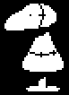

+++
title = "Dummy (训练人偶/假人)"
description = "UNDERTALE enemy animation analysis - Dummy"
date = 2026-04-11T22:29:21+08:00
updated = 2026-04-11T22:29:21+08:00
draft = false
weight = 7
template = "page.html"

[extra]
  author = "毫无技术的鸽子"

  toc = true
  top = false
  utaf_data = "/utaf/ruins/dummy.json"
  utaf_lab_url = "/lab/dummy/"
+++

---

## 组成拆解

Dummy 它本身且无任何额外动作，除了砍击切换图片。

