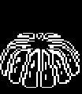

+++
title = "Moldsmal (小模怪)"
description = "UNDERTALE enemy animation analysis - Moldsmal"
date = 2026-04-11T22:29:21+08:00
updated = 2026-04-11T22:29:21+08:00
draft = false
weight = 6
template = "page.html"

[extra]
  author = "毫无技术的鸽子"

  toc = true
  top = false
  utrp_data = "/utrp/ruins/moldsmal.json"
+++


---

## 组成拆解

Moldsmal 单个图片进行竖直方向的伸缩（image_yscale）。



## 公式

```c
if (image_yscale < 0.9)
    scalevalue = 0.01
if (image_yscale > 1.1)
    scalevalue = -0.01
image_yscale += scalevalue
y -= (102 * scalevalue)
```

说明：
- 如果图片伸缩小于 0.9 倍，那么放大倍率为 0.01
- 如果图片伸缩大于 1.1 倍，那么放大倍率为 -0.01（或者说缩小倍率 0.01）
- y 值随着 scalevalue 的变化有 y = y - 102 * sv 的变化公式

实际制作的时候可以考虑把 y 设置在最下方，然后只改变 yscale，就没必要改变 y 值了。

> **维护者注：** 原作中的 `y -= (102 * scalevalue)` 实际上使用了精灵的**宽度** 102 而非**高度** 84 来计算 y 补偿，这是原作的一个 bug——导致底部并非完全固定，会有轻微漂移。UTAF 实现中直接将 `pivot` 设为底部中心 `(51, 84)`，让缩放自然以底边为锚点，效果比原作更精确。