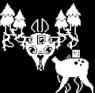

+++
title = "Gyftrot (礼物鹿)"
description = "Undertale enemy animation analysis - Gyftrot"
date = 2026-04-11T22:29:21+08:00
updated = 2026-04-11T22:29:21+08:00
draft = false
weight = 4
template = "page.html"

[extra]
  author = "毫无技术的鸽子"

  toc = true
  top = false
  utaf_data = "/utaf/snowdin/gyftrot.json"
  utaf_lab_url = "/lab/gyftrot/"
+++


---

## 组成拆解

Gyftrot 由 **身体（body）+ 眼睛和眼睛上半部分（head）+ 眼睛和眼镜下半部分（mouth）+ 云雾（cloud）+ 礼物（gift）** 组成。



## 公式整理

```plaintext
礼物：
永远保持跟随头部的x, y

身体：
保持不动

眼睛和眼睛上半部分：
如果x比初始创建的位置+8要小，那么水平速度为1，反之为-1
同时在8 + U(0, 10)时间范围内将水平速度设置为0
开始跟随嘴巴的速度移动

眼睛和眼睛下半部分：
和上半部分相反
```

### 补充说明

礼物鹿头和嘴巴的效果是什么情况：首先，礼物鹿的头分成三个节点，它会在这三个位置停下：x-8, x, x+8。其次，礼物鹿在 x 到 x+8 这段范围是嘴巴跟随头部移动的；而在 x-8 到 x 这段区域，是头部跟随嘴巴移动的。二者互相在各自范围作用，形成了在三点之间往返运动的效果。