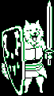

+++
title = "Lesser Dog (小犬汪)"
description = "UNDERTALE enemy animation analysis - Lesser Dog"
date = 2026-04-11T22:29:21+08:00
updated = 2026-04-11T22:29:21+08:00
draft = false
weight = 7
template = "page.html"

[extra]
  author = "毫无技术的鸽子"

  toc = true
  top = false
+++


---

## 组成拆解

Lesser Dog 由 **全身（lesserdog）+ 尾巴（tail）+ 头（head）** 组成。



## 公式整理

```plaintext
以防你不知道：
脖子的绘制其实是使用矩形完成的
尾巴会随着饶恕次数增加而加快图片切换速度

假设饶恕次数为mercymod / 900
头y：(mercymod - 500) / 4 + 40
```