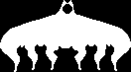

+++
title = "Endogeny (融合犬)"
description = "Undertale enemy animation analysis - Endogeny"
date = 2026-04-11T22:29:21+08:00
updated = 2026-04-11T22:29:21+08:00
draft = false
weight = 2
template = "page.html"

[extra]
  author = "毫无技术的鸽子"

  toc = true
  top = false
+++


---

## 组成拆解

Endogeny 由 **下半部分身体（body）+ 头部（head）** 组成。



## 公式整理

```plaintext
没摸的情况下，shaker为1
摸了一次的情况下，shaker为2
摸了三 次的情况下，shaker为4

--------------------------

x, y = random(shaker) - random(shaker)
头部也是这样的
```