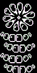

+++
title = "Moldbygg (大模怪)"
description = "UNDERTALE enemy animation analysis - Moldbygg"
date = 2026-04-11T22:29:21+08:00
updated = 2026-04-11T22:29:21+08:00
draft = false
weight = 3
template = "page.html"

[extra]
  author = "毫无技术的鸽子"

  toc = true
  top = false
  utaf_data = "/utaf/waterfall/moldbygg.json"
  utaf_lab_url = "/lab/moldbygg/"
+++


---

## 组成拆解

Moldbygg 由 **果冻花（up）+ 底层（stem）** 组成。



## 公式整理

```plaintext
底座：
x：x + 8 * sin(timer / 10)或x + 8 * cos(timer / 10)

果冻花：
x：x + 4 * cos(timer / 10)
```