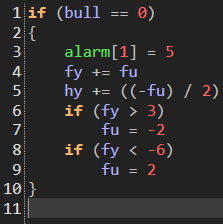
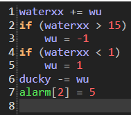

+++
title = "Woshua (约刷亚)"
description = "UNDERTALE enemy animation analysis - Woshua"
date = 2026-04-11T22:29:21+08:00
updated = 2026-04-11T22:29:21+08:00
draft = false
weight = 2
template = "page.html"

[extra]
  author = "毫无技术的鸽子"

  toc = true
  top = false
  utrp_data = "/utrp/waterfall/woshua.json"
+++


---

## 组成拆解

Woshua 由 **身体外壳（body）+ 鸭子（duck）+ 头部（head）+ 脸（face）+ 尾巴摇杆（tail）+ 水（water）+ 玻璃罩（hanger）** 组成。


## 公式整理

```javascript
玻璃罩：保持不动
鸭子：
x：x + 46
y：每15帧切换上下状态，每次鸭子都会以每帧1个像素做上下移动

水1：
x：x + 40 - 4 * sin(time / 10)
水2：
x：x + 40 + 4 * sin(time / 10)
两个水的y相同

摇杆（发条）：
x：x + 88
y：y + 50

头部和脸部很难直接写出公式，这里简单介绍一下
脸和头的运动方向相反，而且脸的速度是头的二倍
```

### 补充说明

如果要写的话，那就太逆天了：



